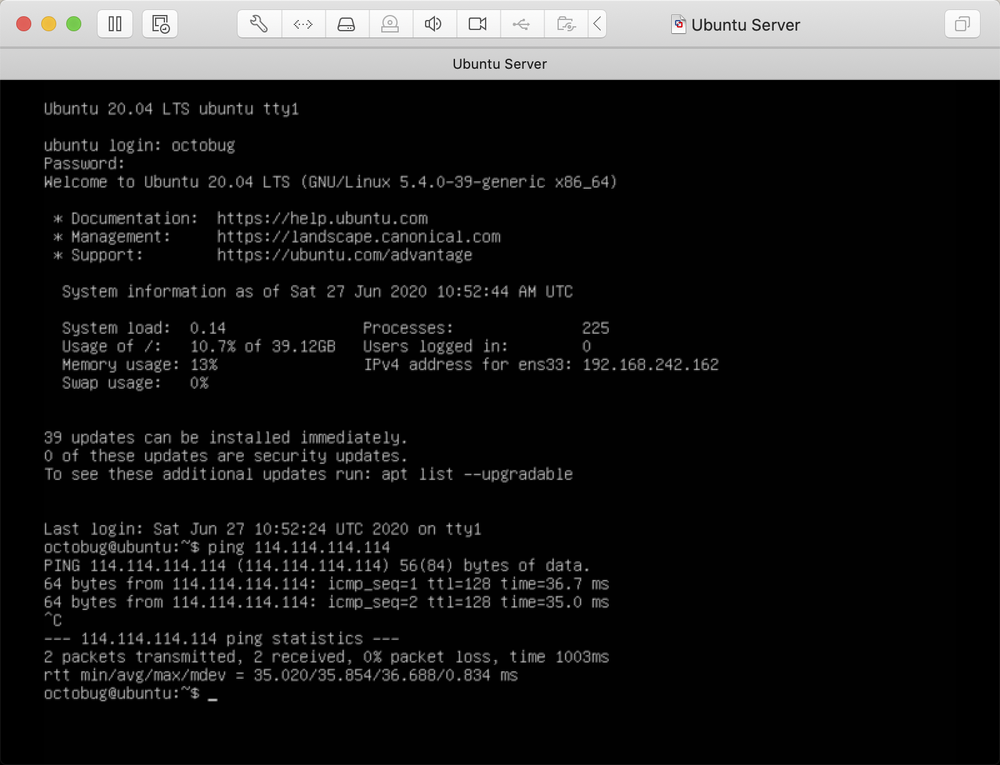

# 1. 环境准备

## 1.1 一台全新的 Linux 服务器

[ubuntu_mrs]: https://mirrors.tuna.tsinghua.edu.cn/ubuntu-releases/20.04/
[ubuntu_iso]: https://mirrors.tuna.tsinghua.edu.cn/ubuntu-releases/20.04/ubuntu-20.04-desktop-amd64.iso

本项目所使用的“远程”服务器为一台安装在本地虚拟机里的 `Ubuntu Server 20.04 x64`，镜像可从 [ubuntu-releases/20.04][ubuntu_mrs] 获取，具体的镜像文件是 [`ubuntu-20.04-live-server-amd64.iso`][ubuntu_iso]。

虚拟机软件建议使用 `VMware` 或 `VirtualBox`。

### 1.1.1 初始环境

- 网络
  - 宿主机设置虚拟机网络为 NAT 模式
- Linux 用户
  - 安装操作系统时按照流程设置用户：`octobug`
- OpenSSH
  - 安装操作系统时选择安装 OpenSSH Server

以上为安装 `Ubuntu Server 20.04 x64` 时自定义的少量配置，其余均为默认配置。

安装后虚拟机的登录界面如下：



如图所示，安装后 DHCP 分配的 IPv4 为 `192.168.242.162`。

## 1.2 安装 Ansible

Ansible 只需要在操作机器上安装，安装之后就可以使用 Ansible 基于 SSH 来操作远程主机。远程主机不需要额外安装任何其他跟 Ansible 相关的软件（当然 OpenSSH Server、Python 解释器等软件还是需要的，但这些一般是 Linux 标配）。因此说 Ansible 是“无客户端的”，无需担心远程主机因为安装的自动化工具存在漏洞而被入侵。

[ins_guide]: https://docs.ansible.com/ansible/latest/installation_guide/index.html

官网有非常详细的安装文档：[Installation Guide][ins_guide]

```bash
$ ansible --version
ansible 2.8.4
  config file = None
  configured module search path = ['/Users/octobug/.ansible/plugins/modules', '/usr/share/ansible/plugins/modules']
  ansible python module location = /usr/local/Cellar/ansible/2.8.4_1/libexec/lib/python3.7/site-packages/ansible
  executable location = /usr/local/bin/ansible
  python version = 3.7.4 (default, Jul  9 2019, 18:13:23) [Clang 10.0.1 (clang-1001.0.46.4)]
```

## 1.3 测试

### 1.3.1 测试使用 Ansible 连接服务器

使用 **1.2** 小节安装的 Ansible 访问 **1.1** 小节中安装的“远程”服务器。

由于服务器上还没有 SSH 登录到 octobug 账户的公钥，所以先尝试用密码连接主机：

```bash
ansible all -i "192.168.242.162," -m ping -u octobug -k
```

- `-i`：用于指定 `inventory` 文件，inventory 里面记录的是主机的 IP 信息，但此处先不使用 inventory 文件，而是用一个字符串代替 `192.168.242.162,`（注意后面要有个逗号）
- `all`：作用于 inventory 文件中的所有主机，这个例子中只有一个主机 IP 地址
- `-m`：指定 Ansible 模块，这个例子指定了 `ping` 模块
- `-u`：指定登录远程主机的账户名
- `-k`：使用密码登录

更多参数请查看 `ansible -h`。

```bash
$ ansible all -i "192.168.242.162," -m ping -u octobug -k
SSH password:
192.168.242.162 | FAILED! => {
    "msg": "to use the 'ssh' connection type with passwords,
      you must install the sshpass program"
}
```

显然，此时需要本机安装有 sshpass 来提供 SSH 密码。然而使用 sshpass 容易造成安全问题，macOS 上最流行的包管理器 `brew` 甚至直接拒绝加入 sshpass 这个包：

```bash
$ brew install sshpass
Updating Homebrew...
Error: No available formula with the name "sshpass"
We won't add sshpass because it makes it too easy for novice SSH users to ruin
  SSH's security.
```

[sshpass]: https://groups.google.com/forum/#!topic/ansible-project/VXxqo88x1Zc

相关话题：[Using ansbile and ansbile-playbook with just the password for the remote host][sshpass]

> Ansible doesn't require openssh-server on the control machine, but when you are using ssh with password the program "sshpass" is needed on the control machine since ssh doesn’t provide this functionality itself.

既然如此，我们改用 SSH Key 登录。

### 1.3.2 `ssh-copy-id`

```bash
$ ssh-copy-id octobug@192.168.242.162
/usr/bin/ssh-copy-id: INFO: Source of key(s) to be installed: "/Users/octobug/.ssh/id_rsa.pub"
/usr/bin/ssh-copy-id: INFO: attempting to log in with the new key(s), to filter out any that are already installed
/usr/bin/ssh-copy-id: INFO: 1 key(s) remain to be installed -- if you are prompted now it is to install the new keys
octobug@192.168.242.162's password:

Number of key(s) added:        1

Now try logging into the machine, with:
  "ssh 'octobug@192.168.242.162'" and check to make sure that only the key(s) you
  wanted were added.
```

### 1.3.3 重新测试

这次将会使用 SSH Key 登录，因此不指定 `-k`。

```bash
$ ansible all -i "192.168.242.162," -m ping -u octobug
192.168.242.162 | SUCCESS => {
    "ansible_facts": {
        "discovered_interpreter_python": "/usr/bin/python3"
    },
    "changed": false,
    "ping": "pong"
}
```

- `"ansible_facts"`：Ansible 关心并从远程主机收集的基本信息
- `"changed": false`：远程主机相关状态未被 Ansible ping 模块改变
- `"ping": "pong"`：ping 模块的执行结果

至此，本地操作机已经可以和“远程”主机正常通信。

### 1.3.4 Ansible 使用 `ping` 做了些什么？

`1.3.3` 小节中 Ansible 返回了这样一段信息 `"discovered_interpreter_python": "/usr/bin/python3"`，它是如何采集的？下面增加 `-vvv`选项（最多支持 5 个 `v`） 来查看 Ansible 的工作过程。

从下面的输出可以看出，Ansible 在远程服务器上主要做了以下几件事：

- 尝试使用 `octobug` 账户登录服务器
- 在服务器上初始化临时目录 `/home/octobug/.ansible/tmp`
- 检测服务器操作系统版本信息和 Python 解释器信息
- 使用 `sftp` 服务上传 `ping` 模块的 .py 脚本
- 为 `ping` 脚本设置可执行权限
- 执行 `ping` 脚本
- 清理临时目录

```bash
$ ansible all -i "192.168.242.162," -m ping -u octobug -vvv
ansible 2.9.10
  config file = None
  configured module search path = ['/Users/octobug/.ansible/plugins/modules', '/usr/share/ansible/plugins/modules']
  ansible python module location = /Users/octobug/.local/lib/python3.7/site-packages/ansible
  executable location = /Users/octobug/.local/bin/ansible
  python version = 3.7.3 (default, Apr 24 2019, 10:44:04) [Clang 10.0.1 (clang-1001.0.46.4)]
No config file found; using defaults
Parsed 192.168.242.162, inventory source with host_list plugin
META: ran handlers
<192.168.242.162> ESTABLISH SSH CONNECTION FOR USER: octobug
<192.168.242.162> SSH: EXEC ssh -C -o ControlMaster=auto -o ControlPersist=60s -o KbdInteractiveAuthentication=no -o PreferredAuthentications=gssapi-with-mic,gssapi-keyex,hostbased,publickey -o PasswordAuthentication=no -o 'User="octobug"' -o ConnectTimeout=10 -o ControlPath=/Users/octobug/.ansible/cp/513cab52f6 192.168.242.162 '/bin/sh -c '"'"'echo ~octobug && sleep 0'"'"''
<192.168.242.162> (0, b'/home/octobug\n', b'')
<192.168.242.162> ESTABLISH SSH CONNECTION FOR USER: octobug
<192.168.242.162> SSH: EXEC ssh -C -o ControlMaster=auto -o ControlPersist=60s -o KbdInteractiveAuthentication=no -o PreferredAuthentications=gssapi-with-mic,gssapi-keyex,hostbased,publickey -o PasswordAuthentication=no -o 'User="octobug"' -o ConnectTimeout=10 -o ControlPath=/Users/octobug/.ansible/cp/513cab52f6 192.168.242.162 '/bin/sh -c '"'"'( umask 77 && mkdir -p "` echo /home/octobug/.ansible/tmp `"&& mkdir /home/octobug/.ansible/tmp/ansible-tmp-1593444481.745457-85483-162128629383522 && echo ansible-tmp-1593444481.745457-85483-162128629383522="` echo /home/octobug/.ansible/tmp/ansible-tmp-1593444481.745457-85483-162128629383522 `" ) && sleep 0'"'"''
<192.168.242.162> (0, b'ansible-tmp-1593444481.745457-85483-162128629383522=/home/octobug/.ansible/tmp/ansible-tmp-1593444481.745457-85483-162128629383522\n', b'')
<192.168.242.162> Attempting python interpreter discovery
<192.168.242.162> ESTABLISH SSH CONNECTION FOR USER: octobug
<192.168.242.162> SSH: EXEC ssh -C -o ControlMaster=auto -o ControlPersist=60s -o KbdInteractiveAuthentication=no -o PreferredAuthentications=gssapi-with-mic,gssapi-keyex,hostbased,publickey -o PasswordAuthentication=no -o 'User="octobug"' -o ConnectTimeout=10 -o ControlPath=/Users/octobug/.ansible/cp/513cab52f6 192.168.242.162 '/bin/sh -c '"'"'echo PLATFORM; uname; echo FOUND; command -v '"'"'"'"'"'"'"'"'/usr/bin/python'"'"'"'"'"'"'"'"'; command -v '"'"'"'"'"'"'"'"'python3.7'"'"'"'"'"'"'"'"'; command -v '"'"'"'"'"'"'"'"'python3.6'"'"'"'"'"'"'"'"'; command -v '"'"'"'"'"'"'"'"'python3.5'"'"'"'"'"'"'"'"'; command -v '"'"'"'"'"'"'"'"'python2.7'"'"'"'"'"'"'"'"'; command -v '"'"'"'"'"'"'"'"'python2.6'"'"'"'"'"'"'"'"'; command -v '"'"'"'"'"'"'"'"'/usr/libexec/platform-python'"'"'"'"'"'"'"'"'; command -v '"'"'"'"'"'"'"'"'/usr/bin/python3'"'"'"'"'"'"'"'"'; command -v '"'"'"'"'"'"'"'"'python'"'"'"'"'"'"'"'"'; echo ENDFOUND && sleep 0'"'"''
<192.168.242.162> (0, b'PLATFORM\nLinux\nFOUND\n/usr/bin/python3\nENDFOUND\n', b'')
<192.168.242.162> ESTABLISH SSH CONNECTION FOR USER: octobug
<192.168.242.162> SSH: EXEC ssh -C -o ControlMaster=auto -o ControlPersist=60s -o KbdInteractiveAuthentication=no -o PreferredAuthentications=gssapi-with-mic,gssapi-keyex,hostbased,publickey -o PasswordAuthentication=no -o 'User="octobug"' -o ConnectTimeout=10 -o ControlPath=/Users/octobug/.ansible/cp/513cab52f6 192.168.242.162 '/bin/sh -c '"'"'/usr/bin/python3 && sleep 0'"'"''
<192.168.242.162> (0, b'{"platform_dist_result": [], "osrelease_content": "NAME=\\"Ubuntu\\"\\nVERSION=\\"20.04 LTS (Focal Fossa)\\"\\nID=ubuntu\\nID_LIKE=debian\\nPRETTY_NAME=\\"Ubuntu 20.04 LTS\\"\\nVERSION_ID=\\"20.04\\"\\nHOME_URL=\\"https://www.ubuntu.com/\\"\\nSUPPORT_URL=\\"https://help.ubuntu.com/\\"\\nBUG_REPORT_URL=\\"https://bugs.launchpad.net/ubuntu/\\"\\nPRIVACY_POLICY_URL=\\"https://www.ubuntu.com/legal/terms-and-policies/privacy-policy\\"\\nVERSION_CODENAME=focal\\nUBUNTU_CODENAME=focal\\n"}\n', b'')
Using module file /Users/octobug/.local/lib/python3.7/site-packages/ansible/modules/system/ping.py
<192.168.242.162> PUT /Users/octobug/.ansible/tmp/ansible-local-85477irz20z0r/tmp15j2ul71 TO /home/octobug/.ansible/tmp/ansible-tmp-1593444481.745457-85483-162128629383522/AnsiballZ_ping.py
<192.168.242.162> SSH: EXEC sftp -b - -C -o ControlMaster=auto -o ControlPersist=60s -o KbdInteractiveAuthentication=no -o PreferredAuthentications=gssapi-with-mic,gssapi-keyex,hostbased,publickey -o PasswordAuthentication=no -o 'User="octobug"' -o ConnectTimeout=10 -o ControlPath=/Users/octobug/.ansible/cp/513cab52f6 '[192.168.242.162]'
<192.168.242.162> (0, b'sftp> put /Users/octobug/.ansible/tmp/ansible-local-85477irz20z0r/tmp15j2ul71 /home/octobug/.ansible/tmp/ansible-tmp-1593444481.745457-85483-162128629383522/AnsiballZ_ping.py\n', b'')
<192.168.242.162> ESTABLISH SSH CONNECTION FOR USER: octobug
<192.168.242.162> SSH: EXEC ssh -C -o ControlMaster=auto -o ControlPersist=60s -o KbdInteractiveAuthentication=no -o PreferredAuthentications=gssapi-with-mic,gssapi-keyex,hostbased,publickey -o PasswordAuthentication=no -o 'User="octobug"' -o ConnectTimeout=10 -o ControlPath=/Users/octobug/.ansible/cp/513cab52f6 192.168.242.162 '/bin/sh -c '"'"'chmod u+x /home/octobug/.ansible/tmp/ansible-tmp-1593444481.745457-85483-162128629383522/ /home/octobug/.ansible/tmp/ansible-tmp-1593444481.745457-85483-162128629383522/AnsiballZ_ping.py && sleep 0'"'"''
<192.168.242.162> (0, b'', b'')
<192.168.242.162> ESTABLISH SSH CONNECTION FOR USER: octobug
<192.168.242.162> SSH: EXEC ssh -C -o ControlMaster=auto -o ControlPersist=60s -o KbdInteractiveAuthentication=no -o PreferredAuthentications=gssapi-with-mic,gssapi-keyex,hostbased,publickey -o PasswordAuthentication=no -o 'User="octobug"' -o ConnectTimeout=10 -o ControlPath=/Users/octobug/.ansible/cp/513cab52f6 -tt 192.168.242.162 '/bin/sh -c '"'"'/usr/bin/python3 /home/octobug/.ansible/tmp/ansible-tmp-1593444481.745457-85483-162128629383522/AnsiballZ_ping.py && sleep 0'"'"''
<192.168.242.162> (0, b'\r\n{"ping": "pong", "invocation": {"module_args": {"data": "pong"}}}\r\n', b'Shared connection to 192.168.242.162 closed.\r\n')
<192.168.242.162> ESTABLISH SSH CONNECTION FOR USER: octobug
<192.168.242.162> SSH: EXEC ssh -C -o ControlMaster=auto -o ControlPersist=60s -o KbdInteractiveAuthentication=no -o PreferredAuthentications=gssapi-with-mic,gssapi-keyex,hostbased,publickey -o PasswordAuthentication=no -o 'User="octobug"' -o ConnectTimeout=10 -o ControlPath=/Users/octobug/.ansible/cp/513cab52f6 192.168.242.162 '/bin/sh -c '"'"'rm -f -r /home/octobug/.ansible/tmp/ansible-tmp-1593444481.745457-85483-162128629383522/ > /dev/null 2>&1 && sleep 0'"'"''
<192.168.242.162> (0, b'', b'')
192.168.242.162 | SUCCESS => {
    "ansible_facts": {
        "discovered_interpreter_python": "/usr/bin/python3"
    },
    "changed": false,
    "invocation": {
        "module_args": {
            "data": "pong"
        }
    },
    "ping": "pong"
}
META: ran handlers
META: ran handlers
```

---

下一节，将使用 Ansible Playbook 来完成几项基本的系统配置，并通过它介绍 Ansible 中的常见术语。
